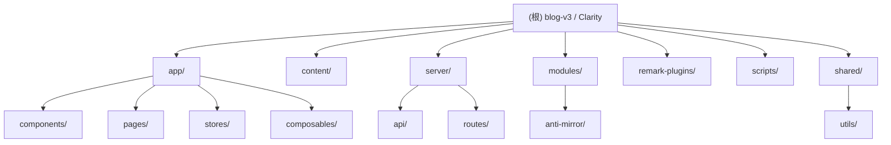

# CLAUDE.md — blog-v3 (Clarity)

> 变更记录 (Changelog)
>
> | 日期 | 变更内容 | 作者 |
> |------|----------|------|
> | 2026-04-29 | 初始化架构文档，完成模块识别与扫描 | Claude (架构师) |

## 项目愿景

Clarity（内部代号 blog-v3）是一个基于 Nuxt 4 的个人技术博客，以"清晰、可读、可维护"为核心理念。项目采用 Vue 3 Composition API + TypeScript + SCSS 技术栈，使用 @nuxt/content 管理 Markdown 文章，通过 Pinia 进行状态管理，pnpm workspaces + catalogs 统一依赖版本。

博客内容主要覆盖：网络技术、服务器部署、内网穿透、静态网站搭建、CDN 优化、容器化部署等领域的技术教程与实践经验。

## 架构总览

本项目为**单包 Monorepo**（通过 pnpm-workspace.yaml 启用），按功能分层的 Nuxt 4 应用：

```
blog-v3/
├── app/                    # 应用层（Nuxt 3 App Layer）
│   ├── assets/             # 静态资源（CSS/SCSS、图标、自定义字体）
│   ├── components/         # Vue 组件（按功能分 7 个子目录）
│   ├── composables/        # 组合式函数（useArticle, useToc, usePagination 等）
│   ├── pages/              # 基于文件的路由页面
│   ├── stores/             # Pinia 状态管理
│   ├── plugins/            # Nuxt 插件（tippy, easter-egg, init）
│   ├── types/              # TypeScript 类型定义
│   └── utils/              # 工具函数（anim, img）
├── content/                # 内容层（Markdown 文章）
│   ├── posts/              # 按年份组织的博客文章
│   └── previews/           # 预览/草稿文章
├── server/                 # 服务端 API（Nitro）
│   ├── api/                # JSON API 端点
│   └── routes/             # 特殊路由（Atom 订阅源等）
├── modules/                # 自定义 Nuxt 模块
│   └── anti-mirror/        # 反镜像站保护
├── remark-plugins/         # 自定义 Markdown 处理插件
├── shared/                 # 客户端/服务端共享工具
├── scripts/                # CLI 开发脚本
├── patches/                # pnpm 依赖补丁
└── public/                 # 静态资源（图片、字体）
```

## 模块结构图 (Mermaid)



## 模块索引

| 模块 | 路径 | 职责 | 技术栈 | 文档 |
|------|------|------|--------|------|
| 配置中心 | `.` | 项目级配置、构建脚本、代码规范 | TS / JSON / YAML | (本文档) |
| 应用层 | `app/` | Vue 组件、页面、状态管理、路由 | Vue 3 / TS / SCSS | [app/CLAUDE.md](app/CLAUDE.md) |
| 内容层 | `content/` | Markdown 文章管理、主题配置 | Markdown / YAML | [content/CLAUDE.md](content/CLAUDE.md) |
| 服务端 | `server/` | API 路由、Atom 订阅源生成 | Nitro / TS | [server/CLAUDE.md](server/CLAUDE.md) |
| 反镜像模块 | `modules/anti-mirror/` | 恶意镜像站检测与跳转 | Nuxt Module / TS | [modules/anti-mirror/CLAUDE.md](modules/anti-mirror/CLAUDE.md) |
| 内容插件 | `remark-plugins/` | 自定义 Markdown 处理插件 | Remark / Rehype | [remark-plugins/CLAUDE.md](remark-plugins/CLAUDE.md) |
| 脚本工具 | `scripts/` | 新建文章、项目初始化、订阅源检查 | TS / @clack/prompts | [scripts/CLAUDE.md](scripts/CLAUDE.md) |
| 共享工具 | `shared/` | 客户端/服务端共享工具函数 | TS | [shared/CLAUDE.md](shared/CLAUDE.md) |

## 运行与开发

### 环境要求

- Node.js >= 22.18（或 >= 23.6）
- pnpm >= 10
- 包管理器：`pnpm@10.32.1`

### 常用命令

```bash
pnpm dev              # 启动开发服务器（自动打开浏览器）
pnpm dev:host         # 启动并暴露到局域网
pnpm build            # 生产构建
pnpm generate         # 静态站点生成
pnpm preview          # 本地预览生产构建
pnpm prepare          # 清理缓存 + nuxt prepare
pnpm lint             # ESLint + Stylelint 检查
pnpm lint:fix         # 自动修复 lint 问题
pnpm new              # 交互式新建文章
pnpm init-project     # 初始化项目（清空内容 + 重置配置）
pnpm check:feed       # 验证 Atom 订阅源
pnpm bump             # 批量升级依赖
```

### 核心配置入口

| 文件 | 用途 |
|------|------|
| `blog.config.ts` | 站点全局配置（标题、作者、分类、订阅源、脚本等） |
| `nuxt.config.ts` | Nuxt 框架配置（模块、SEO、图片、渲染等） |
| `content.config.ts` | 内容集合 schema（Zod 校验 front matter） |
| `app/app.config.ts` | 运行时 UI 配置（导航、页脚、分页、主题） |
| `app/shiki.config.ts` | 代码高亮配置（主题、转换器） |

## 测试策略

**当前状态：项目未配置测试框架。** 代码质量通过以下方式保障：

- `pnpm lint`：ESLint（@antfu/eslint-config）+ Stylelint（@zinkawaii/stylelint-config）
- `pnpm build`：生产构建作为正确性验证
- `pnpm check:feed`：验证 Atom 订阅源输出
- 开发模式下的 HMR 即时反馈

建议后续引入 Vitest 做单元测试，Playwright 做端到端测试。

## 编码规范

详细编码规范请参见 `AGENTS.md`（由 nuxt-llms 自动生成），以下为关键要点速查：

### 格式化

- **缩进**：Tab（JSON/YAML/Markdown 使用 2 空格）
- **行尾**：LF
- **Vue**：`<script lang="ts">` + `<style lang="scss" scoped>`

### 导入别名

- `~/` → `app/` 目录
- `~~/` → 项目根目录
- `@/` → CSS/SCSS 资源

### 命名约定

| 项目 | 约定 | 示例 |
|------|------|------|
| Vue 组件 | PascalCase | `ThemeToggle.vue` |
| 通用组件 | `Z` 前缀 | `ZButton.vue`, `ZPagination.vue` |
| 组合式函数 | `use` 前缀 | `useArticle.ts` |
| Pinia Store | `use*Store` | `useContentStore` |
| 服务端路由 | RESTful 文件名 | `stats.get.ts` |
| 配置注释 | `// @keep-sorted` | 标记需排序的列表 |

### 关键库

- **es-toolkit** — 替代 lodash 的工具函数库
- **temporal-polyfill** — 日期时间处理（Temporal API）
- **shiki** — 代码语法高亮
- **@vueuse/core** — Vue 组合式工具集
- **minisearch** — 客户端全文搜索
- **parse-domain** — URL 域名解析

## AI 使用指引

- 修改代码后运行 `pnpm lint` 验证正确性
- `components/partial/` 下的组件以 `Z` 为前缀，全局自动注册
- `// @keep-sorted` 标记表示需保持字母排序的对象键
- 使用 `blogConfig`（`~~/blog.config`）获取站点配置
- 使用 `appConfig`（`~/app.config`）获取运行时 UI 配置
- `content/` 目录有宽松的 lint 规则，不要在此应用严格格式化
- 没有测试框架，通过 `pnpm lint` + `pnpm build` 验证变更
